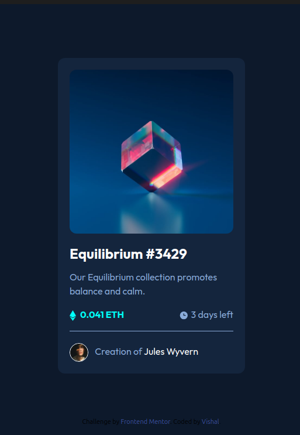

# Frontend Mentor - NFT preview card component solution

This is a solution to the [NFT preview card component challenge on Frontend Mentor](https://www.frontendmentor.io/challenges/nft-preview-card-component-SbdUL_w0U). Frontend Mentor challenges help you improve your coding skills by building realistic projects. 

## Table of contents

- [Overview](#overview)
  - [The challenge](#the-challenge)
  - [Screenshot](#screenshot)
  - [Links](#links)
- [My process](#my-process)
  - [Built with](#built-with)
  - [What I learned](#what-i-learned)
- [Author](#author)


## Overview

### The challenge

Users should be able to:

- View the optimal layout depending on their device's screen size
- See hover states for interactive elements

### Screenshot



### Links

- Solution URL: [github_link](https://your-solution-url.com)
- Live Site URL: [live_site](https://your-live-site-url.com)

## My process
feedback and implement

### Built with

- Semantic HTML5 markup
- CSS custom properties
- Flexbox
- CSS Grid
- Mobile-first workflow


### What I learned


Learned how to overlay another div onto a image / div , see below:

```html
<a href="#" class="relative rounded-xl inline-block">
  <div class="hover:opacity-100 opacity-0 flex bg-[hsla(178,100%,50%,0.5)] rounded-xl absolute top-0 left-0 right-0 bottom-0 items-center justify-center">
    <svg width="48" height="48" xmlns="http://www.w3.org/2000/svg"><g fill="none" fill-rule="evenodd"><path d="M0 0h48v48H0z"/><path d="M24 9C14 9 5.46 15.22 2 24c3.46 8.78 12 15 22 15 10.01 0 18.54-6.22 22-15-3.46-8.78-11.99-15-22-15Zm0 25c-5.52 0-10-4.48-10-10s4.48-10 10-10 10 4.48 10 10-4.48 10-10 10Zm0-16c-3.31 0-6 2.69-6 6s2.69 6 6 6 6-2.69 6-6-2.69-6-6-6Z" fill="#FFF" fill-rule="nonzero"/></g></svg>
  </div>
  
</a>
```

## Author

- Website - [Vishal]()


